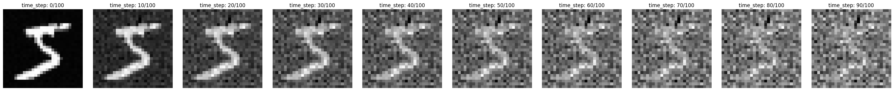
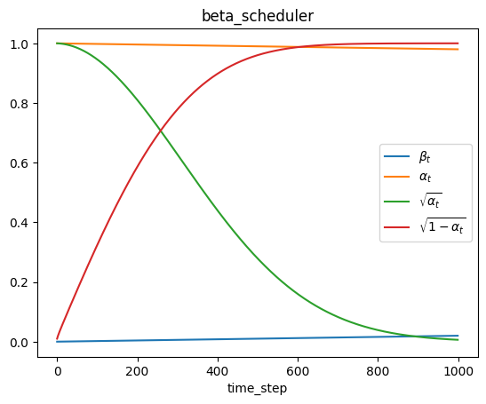

In this blog, I'll put a quick implementation for diffusion model on MNIST. (So that you can easily run it on the kaggle). The article will cover a brief ddpm introduction. 

# What's Diffusion model  

As you may already heard about, a diffusion model is the process of adding noise gradually and denoise step by step. The general idea of diffusion model is to add Gaussian noise for finite time step, transfering the distribution of target to the known distribution (Gaussian) and learn the reverse part for every time step.  
So that, we feed the diffusion a noisy input with how much (the diffusion time step) the noise is added to the picture, and ask for the diffusion model to guess where the noise is.  
The forward process of diffusion can be seen as adding noise $\epsilon$
$$
x_t = \sqrt{\alpha_t} \, x_0 + \sqrt{1- \alpha_t} \, \epsilon, \quad \epsilon \sim \mathcal{N}(0, 1)
$$
Mathematically, if we finally add up to a Gaussian noise, there is a exact reverse process showing how to transfer from the Gaussian back to our target distribution.  
$$
x_{t-1} = \frac{{1}}{\sqrt{\alpha_t}} \left(\, x_{t}  - \frac{\beta_t}{\sqrt{1 -  \bar{\alpha}_t}} \epsilon \right) + \sigma_t z, \; z \sim \mathcal{N}(0, 1)
$$
In the equation above, the diffusion model take over the $\epsilon$, make it $\epsilon_{\theta}(x_t, t)$, which is to predict how much the noise is added into picture. 
$$
x_{t-1} = \frac{{1}}{\sqrt{\alpha_t}} \left(\, x_{t}  - \frac{\beta_t}{\sqrt{1 -  \bar{\alpha}_t}} \epsilon_{\theta}(x_t, t) \right) + \sigma_t z, \; z \sim \mathcal{N}(0, 1)
$$

Note that the diffusion process is a recursive process. Although the model will predict all the added noise in the time step, we won't eliminate all the noise and do single step generate. In fact, we eliminate only a tiny step of noise and feed the noise input into model again to get next time step prediction. 

Here is the visualization of the noise adding process 

__Fig.1 noise scheduler__

Fig.1 shows that every time step we put some noise into pure image, and finally add up to a gaussian noise. 
The way that we add noise is controled by the term call scheduler. Image that we can add the image to gaussian noise at the very begining time step or almost to the last time steps. The noise scheduler is highly related to the image quality.

# Train your diffusion model

## Beta Scheduler 

The beta scheduler in DDPM can be seen as the weight to the noise term.   
In the ddpm orginal paper, it suggest the following notation. 
$$
\alpha_t  = 1 - \beta_t, \quad
\bar{\alpha}_t = \prod_{s = 1}^t \alpha_s, \quad \tilde{\beta}_t \equiv \frac{1-\bar{\alpha}_{t-1}}{1 - \bar{\alpha_t}}\beta_t
$$

In the original paper, they first define the $\beta_t$ then to derive it to different derivative parameter. The linear beta scheduler in the DDPM paper is :   

  
__Fig.2 beta scheduler__   

Here I am trying to do from the opposite, we can first define how we want the noise to be added. We'll see how different scheduler effect the model. 

By some math calculus, we can rewrite the parameter relation as
$$
\alpha_t  = \frac{\bar{\alpha}_{t}}{\bar{\alpha}_{t-1}}, \; \beta_t = 1 - \frac{\bar{\alpha}_{t}}{\bar{\alpha}_{t-1}}
$$

Thus, we can redefine the parameter $\alpha, \beta$ by $\bar{\alpha}$. 
The best things to do this is that we can exactly know how our noise scheduler effect our data. 

*Notice that when you define your noise scheduler, watch out for the $\frac{1}{\sqrt{1-\alpha_t}}$ term in the generating process as it may blow up to infinity if you doesn't set the parameter well. 

# Train 

As for the training part of the Diffusion, we prepared the noised input $x_t = a_t x_0 + b_t \epsilon$, where $a_t$ and $b_t$ are decided by the $\alpha_t$ and $\beta_t$. Then we prepared the $(x_t, t)$ as the input and $\epsilon$ as the output label. Unlike training for whole generating process, we train only from $t$ to $0$ with $t$  sampled accross from $0$ to $T$.  

# Generate 

To generate the image, we first sample a noise $\epsilon_T \sim \mathcal{N}(0, 1)$, sending noise $\epsilon_T$ into model to get the noise prediction $\epsilon_{\theta}$.  And followed the generative process, subtracting the predicted noise with the model predict noise by eq.(eq_num) to get $\epsilon_{T-1}$. iteratively after $T$ timestep we'll achieve a clean image. 

 

# Reference 

